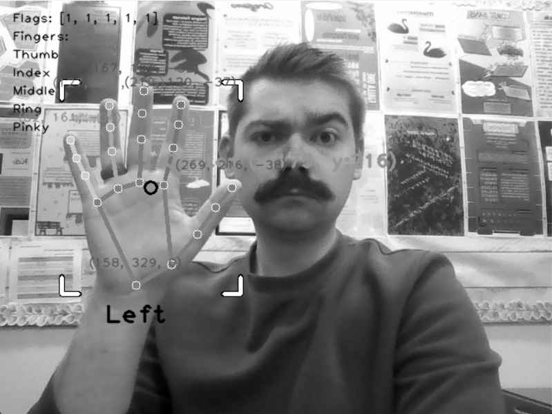
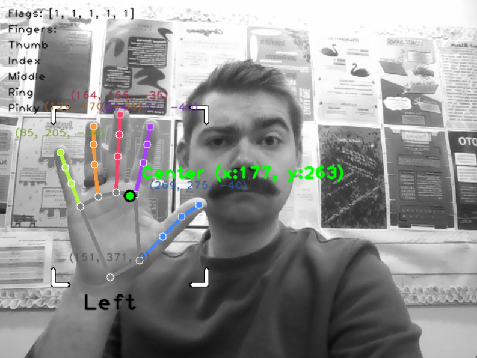
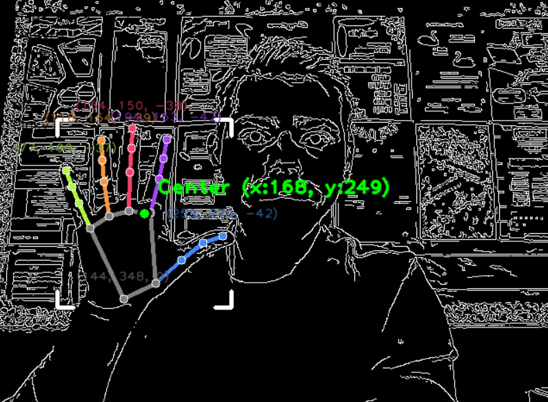

# Challenge 01 - Recolor the Image

This challenge explores using OpenCV to modify the appearance of the image to explore different ways to use the image processing features.

## Mild 🌶️

Create a program that meets the following requirements:

* A live video feed is captured through a webcam.
* The hands have their debug information drawn.
* The displayed image is converted completely to greyscale (black and white) including the debug information.

## Medium 🌶️🌶️

Create a program that meets the following requirements:

* A live video feed is captured through a webcam.
* The hands have their debug information drawn.
* The displayed image is converted completely to greyscale (black and white)
* The debug information is displayed in full color despite the rest of the image being greyscale.

## Spicy 🌶️🌶️🌶️

* A live video feed is captured through a webcam.
* The hands have their debug information drawn.
* The displayed image is converted to edge detection (showing only white outlines with a black background)
* The debug information is displayed in full color on top of the edge detection.

*Hint: Edge detection is in Lesson 3, you must convert to grayscale **before** edge detection, and must convert back to BGR **after** edge detection.*

