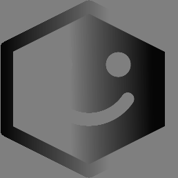

# Lesson 03 - Advanced OpenCV Concepts

## Overview
This lesson is completely optional, but provides some brief outlines on additional ways that OpenCV can be used!

This document covers core OpenCV concepts including image loading, drawing, pixel operations, and image processing techniques used in real-world computer vision workflows.

## Loading Images

This section explains how to load images from disk into memory.

* `cv2.imread()`: Reads an image file into a NumPy array.
* `"image.png"`: The file path to the image.
* The result is stored as an array representing pixel data.
* If loading fails, the result will be `None`.

```python
# Load an image from file
img = cv2.imread(
    "image.png"  # File path
)
```

## Saving Images

This section shows how to save images back to disk.

* `cv2.imwrite()`: Writes an image to a file.
* `"output.png"`: The output file name.
* `img`: The image data to save.
* Existing files will be overwritten.

```python
# Save the image to a new file
cv2.imwrite(
    "output.png",  # File name to save as
    img            # Image to save
)
```

## Displaying Images

This section shows how to display images in a window.

* `cv2.imshow()`: Displays an image in a window.
* `"Window"`: The name of the window.
* `img`: The image to display.

```python
# Show the image in a window
cv2.imshow(
    "Window",  # Window name
    img        # Image to display in the window
)
```

## Image Properties

This section shows how to inspect image information.

* `img.shape`: Returns `(height, width, channels)`.
* `img.size`: Total number of values in the image.
* `img.dtype`: Data type (usually `uint8`).

```python
# Print image properties
print(img.shape)
print(img.size)
print(img.dtype)
```

## Accessing Pixels

This section shows how to read pixel values.

* `img[y, x]`: Accesses a pixel at row `y`, column `x`.
* Returns `[B, G, R]` values.
* Each value ranges from `0` to `255`.

```python
# Get pixel value at (100, 100)
pixel = img[100, 100]
```

## Modifying Pixels

This section shows how to change pixel values.

* `img[y, x] = [B, G, R]`: Sets a pixel color.
* `[255, 0, 0]`: Blue in BGR format.
* Direct modification updates the image instantly.

```python
# Set pixel to blue
img[100, 100] = [255, 0, 0]
```

## Region of Interest (ROI)

This section shows how to work with sections of an image.

* `img[y1:y2, x1:x2]`: Slices a region.
* Regions can be copied and pasted.
* Source and destination must be the same size.

```python
# Copy a region and paste it elsewhere
roi = img[50:100, 50:100]
img[150:200, 150:200] = roi
```

## Splitting Channels

This section shows how to separate color channels.

* `cv2.split()`: Splits into blue, green, red channels.
* Each channel becomes a grayscale image.
* Useful for analyzing colors separately.

```python
# Split into channels
b, g, r = cv2.split(img)
```

## Merging Channels

This section shows how to recombine channels.

* `cv2.merge()`: Combines channels into one image.
* Channels must be in BGR order.
* Used after modifying channels.

```python
# Merge channels back
img = cv2.merge((b, g, r))
```

## Adding Images

This section shows how to combine images.

* `cv2.add()`: Adds pixel values safely (clipped at 255).
* Both images must be same size.
* Prevents overflow issues.

```python
# Add two images
result = cv2.add(img, img)
```

## Blending Images

This section shows how to mix images using weights.

* `cv2.addWeighted()`: Blends two images.
* `0.5, 0.5`: Equal contribution.
* `0`: No brightness offset.

```python
# Blend two images
blend = cv2.addWeighted(
    img,    # First image to blend
    0.5,    # First image blend weight (0.5 is half)
    img_2,  # Second image to blend
    0.5,    # Second image blend weight
    0       # Brightness offset (recommend set to 0)
)
```


## Color Space Conversion

This section shows how to change how color is represented.

* `cv2.cvtColor()`: Converts color spaces.
* `cv2.COLOR_BGR2GRAY`: Converts to grayscale.
* Used for simplifying image processing.

```python
# Convert to grayscale
gray = cv2.cvtColor(
    img,                # Image to convert
    cv2.COLOR_BGR2GRAY  # New color space
)
```

The conversion code always follows the pattern `cv.COLOR_<INPUT>2<OUTPUT>`.

### BGR (Blue, Green, Red)

BGR is the **default color space used by OpenCV**. Each pixel has three channels, representing blue, green, and red values. Even though RGB is more common in other programs, OpenCV loads images as BGR by default.

The table below shows common conversions that start from BGR:

| Code                | Input Color Space                       | Output Color Space                                                       |
|---------------------|-----------------------------------------|--------------------------------------------------------------------------|
| `cv.COLOR_BGR2BGRA` | **BGR** – 3 Channels (Blue, Green, Red) | **BGRA** – 4 Channels (Blue, Green, Red, Alpha)                          |
| `cv.COLOR_BGR2GRAY` | **BGR** – 3 Channels (Blue, Green, Red) | **Gray** – 1 Channel (Brightness)                                        |
| `cv.COLOR_BGR2HSV`  | **BGR** – 3 Channels (Blue, Green, Red) | **HSV** – 3 Channels (Hue/Color, Saturation/Intensity, Value/Brightness) |
| `cv.COLOR_BGR2RGB`  | **BGR** – 3 Channels (Blue, Green, Red) | **RGB** – 3 Channels (Red, Green, Blue)                                  |
| `cv.COLOR_BGR2RGBA` | **BGR** – 3 Channels (Blue, Green, Red) | **RGBA** – 4 Channels (Red, Green, Blue, Alpha)                          |

### RGB (Red, Green, Blue)

RGB is the most common color space used by graphics software, image editors, and displays. Like BGR, it uses three channels, but the order of those channels is red, green, then blue.

These conversions are useful when working with other libraries that expect RGB instead of BGR:

| Code                | Input Color Space                       | Output Color Space                                                       |
|---------------------|-----------------------------------------|--------------------------------------------------------------------------|
| `cv.COLOR_RGB2BGR`  | **RGB** – 3 Channels (Red, Green, Blue) | **BGR** – 3 Channels (Blue, Green, Red)                                  |
| `cv.COLOR_RGB2BGRA` | **RGB** – 3 Channels (Red, Green, Blue) | **BGRA** – 4 Channels (Blue, Green, Red, Alpha)                          |
| `cv.COLOR_RGB2GRAY` | **RGB** – 3 Channels (Red, Green, Blue) | **Gray** – 1 Channel (Brightness)                                        |
| `cv.COLOR_RGB2HSV`  | **RGB** – 3 Channels (Red, Green, Blue) | **HSV** – 3 Channels (Hue/Color, Saturation/Intensity, Value/Brightness) |
| `cv.COLOR_RGB2RGBA` | **RGB** – 3 Channels (Red, Green, Blue) | **RGBA** – 4 Channels (Red, Green, Blue, Alpha)                          |

### GRAY (Grayscale)

Grayscale images store only **brightness information**. Each pixel has a single channel, where lower values are darker and higher values are brighter. Grayscale images are commonly used for thresholding and edge detection because they remove color complexity.

The following conversions show how grayscale images can be converted back into multichannel formats:

| Code                | Input Color Space                                                        | Output Color Space                              |
|---------------------|--------------------------------------------------------------------------|-------------------------------------------------|
| `cv.COLOR_HSV2BGR`  | **HSV** – 3 Channels (Hue/Color, Saturation/Intensity, Value/Brightness) | **BGR** – 3 Channels (Blue, Green, Red)         |
| `cv.COLOR_HSV2BGRA` | **HSV** – 3 Channels (Hue/Color, Saturation/Intensity, Value/Brightness) | **BGRA** – 4 Channels (Blue, Green, Red, Alpha) |
| `cv.COLOR_HSV2RGB`  | **HSV** – 3 Channels (Hue/Color, Saturation/Intensity, Value/Brightness) | **RGB** – 3 Channels (Red, Green, Blue)         |
| `cv.COLOR_HSV2RGBA` | **HSV** – 3 Channels (Hue/Color, Saturation/Intensity, Value/Brightness) | **RGBA** – 4 Channels (Red, Green, Blue, Alpha) |

### HSV (Hue, Saturation, Value)

HSV separates color information into three more intuitive components: hue (the color itself), saturation (how intense the color is), and value (brightness). This makes HSV very useful when you want to isolate or adjust colors.

| Code                 | Input Color Space                 | Output Color Space                              |
|----------------------|-----------------------------------|-------------------------------------------------|
| `cv.COLOR_GRAY2BGR`  | **Gray** – 1 Channel (Brightness) | **BGR** – 3 Channels (Blue, Green, Red)         |
| `cv.COLOR_GRAY2BGRA` | **Gray** – 1 Channel (Brightness) | **BGRA** – 4 Channels (Blue, Green, Red, Alpha) |
| `cv.COLOR_GRAY2RGB`  | **Gray** – 1 Channel (Brightness) | **RGB** – 3 Channels (Red, Green, Blue)         |
| `cv.COLOR_GRAY2RGBA` | **Gray** – 1 Channel (Brightness) | **RGBA** – 4 Channels (Red, Green, Blue, Alpha) |

### BRGA (Blue, Green, Red, Alpha)

BGRA is the same as BGR but with an additional **alpha channel**. The alpha channel controls transparency, where lower values are more transparent and higher values are more opaque.

| Code                 | Input Color Space                               | Output Color Space                                                       |
|----------------------|-------------------------------------------------|--------------------------------------------------------------------------|
| `cv.COLOR_BGRA2BGR`  | **BGRA** – 4 Channels (Blue, Green, Red, Alpha) | **BGR** – 3 Channels (Blue, Green, Red)                                  |
| `cv.COLOR_BGRA2GRAY` | **BGRA** – 4 Channels (Blue, Green, Red, Alpha) | **Gray** – 1 Channel (Brightness)                                        |
| `cv.COLOR_BGRA2HSV`  | **BGRA** – 4 Channels (Blue, Green, Red, Alpha) | **HSV** – 3 Channels (Hue/Color, Saturation/Intensity, Value/Brightness) |
| `cv.COLOR_BGRA2RGB`  | **BGRA** – 4 Channels (Blue, Green, Red, Alpha) | **RGB** – 3 Channels (Red, Green, Blue)                                  |
| `cv.COLOR_BGRA2RGBA` | **BGRA** – 4 Channels (Blue, Green, Red, Alpha) | **RGBA** – 4 Channels (Red, Green, Blue, Alpha)                          |

### RGBA (RED, Green, Blue, Alpha)

RGBA is commonly used in graphics applications where transparency is required. It is identical to RGB, with an added alpha channel.

| Code                 | Input Color Space                               | Output Color Space                                                       |
|----------------------|-------------------------------------------------|--------------------------------------------------------------------------|
| `cv.COLOR_RGBA2RGB`  | **RGBA** – 4 Channels (Red, Green, Blue, Alpha) | **RGB** – 3 Channels (Red, Green, Blue)                                  |
| `cv.COLOR_RGBA2BGR`  | **RGBA** – 4 Channels (Red, Green, Blue, Alpha) | **BGR** – 3 Channels (Blue, Green, Red)                                  |
| `cv.COLOR_RGBA2BGRA` | **RGBA** – 4 Channels (Red, Green, Blue, Alpha) | **BGRA** – 4 Channels (Blue, Green, Red, Alpha)                          |
| `cv.COLOR_RGBA2GRAY` | **RGBA** – 4 Channels (Red, Green, Blue, Alpha) | **Gray** – 1 Channel (Brightness)                                        |
| `cv.COLOR_RGBA2HSV`  | **RGBA** – 4 Channels (Red, Green, Blue, Alpha) | **HSV** – 3 Channels (Hue/Color, Saturation/Intensity, Value/Brightness) |

## Resizing Images

This section shows how to scale images.

* `cv2.resize()`: Changes image size.
* `(width, height)`: New dimensions.
* Used for standardizing image size.

```python
# Resize image
small = cv2.resize(
    img,        # Image to resize
    (100, 100)  # New dimensions (width, height)
)
```

## Thresholding

Thresholding converts a grayscale image into a high-contrast image by deciding which pixels should be considered black or white. This technique is commonly used for object detection and image segmentation.

Thresholding only works on grayscale images.


The code below first converts the image to grayscale, then applies a binary threshold.

```python
# Convert the image you want to threshold to greyscale
grey_img = cv.cvtColor(grey, cv.COLOR_BGR2GRAY)

# The threshold value is the number used to determine what is white and what is black. 
# Pixels less than this value will be black.
# Pixels greater than his value will be white.
threshold_value = 127

# Determines what color to display as "white" in the output.
# 255 will produce a threshold that is black (0) and white (255).
# A value less than 255 will result in a black and grey image
white = 255

# There are different types of thresholding that are outlined later. Binary is the most basic and intuitive one.
threshold_type = cv.THRESH_BINARY

# cv.threshold() returns an image. '_' is used to store the boolean for whether or not an image was successfully produced.
_, grey_threshold = cv.threshold(grey_img, threshold_value, white, threshold_type)
```

### Threshold Types

| Code                   | Description                                                                                                               | Output                                                         |
|------------------------|---------------------------------------------------------------------------------------------------------------------------|----------------------------------------------------------------|
| `cv.THRESH_BINARY`     | Pixels greater than `threshold_value` are *white*. Pixels les than `threshold_value` are *black*.                         |            |
| `cv.THRESH_BINARY_INV` | Pixels greater than `threshold_value` are *black*. Pixels les than `threshold_value` are *black*.                         |    |
| `cv.THRESH_TRUNC`      | Pixels less than `threshold_value` are *unchanged*. Pixels greater than `threshold_value` are set to *`threshold_value`*. |        |
| `cv.THRESH_TOZERO`     | Pixels less than `threshold_value` are set to *black*. Pixels greater than `threshold_value` are *unchanged*.             |          |
| `cv.THRESH_TOZERO_INV` | Pixels greater than `threshold_value` are set to *black*. Pixels less than `threshold_value` are *unchanged*.             |  |

## Edge Detection

This section shows how to detect edges in images.

* `cv2.Canny()`: Detects edges.
* `100, 200`: Threshold values.
* Outputs a binary edge image.

```python
# Detect edges
edges = cv2.Canny(
    img,  # Image to detect edges on
    100,  # "Weak" edge
    200   # "Strong" edge
)
```

## Example - Image Load, Modify, and Display

This example loads an image, modifies it, and displays the result.

```python
import cv2
import numpy as np

# Load image
img = cv2.imread("image.png")

# Draw a rectangle
cv2.rectangle(img, (50, 50), (200, 200), (0, 255, 0), 2)

# Convert to grayscale
gray = cv2.cvtColor(img, cv2.COLOR_BGR2GRAY)

# Display result
cv2.imshow("Window Name", gray)

# Wait for key press or window close
cv2.waitKey(0)
cv2.destroyAllWindows()
```

## Example - Image Blending

This example blends two images together.

```python
import cv2

# Load images
img1 = cv2.imread("image1.png")
img2 = cv2.imread("image2.png")

# Blend images
blend = cv2.addWeighted(img1, 0.5, img2, 0.5, 0)

# Display result
cv2.imshow("Window Name", blend)

# Wait for key press or window close
cv2.waitKey(0)
cv2.destroyAllWindows()
```

## Example - Edge Detection Pipeline

This example converts an image to grayscale and detects edges.

```python
import cv2

# Load image
img = cv2.imread("image.png")

# Convert to grayscale
gray = cv2.cvtColor(img, cv2.COLOR_BGR2GRAY)

# Detect edges
edges = cv2.Canny(gray, 100, 200)

# Display result
cv2.imshow("Window Name", edges)

# Wait for key press or window close
cv2.waitKey(0)
cv2.destroyAllWindows()
```
