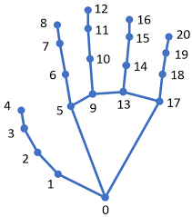

# Lesson 04 - Pumpkinpipe

## Overview

Pumpkinpipe provides a simplified interface for using Mediapipe hand tracking, allowing you to detect hands, access their properties, and draw or analyze them with minimal setup.

## Landmarks

Hands are detected using what are called "landmarks". Different points on the hand are identified with different index numbers, and have different connection points between them. The landmark map for this library looks like this:



## Hand Detector

This section introduces the HandDetector, which is responsible for detecting hands in an image or video frame.

* `HandDetector()`: Creates a detector object.
* `max_hands=2`: Limits how many hands can be detected.
* The detector processes frames and returns detected hands.

```python
# Create a hand detector
hand_detector = HandDetector(max_hands=2)
```

### Find Hands

This section shows how to detect hands in an image frame.

* `hand_detector.find_hands(frame)`: Detects hands in the image.
* `frame`: The image being processed.
* Returns a list of `Hand` objects.
* Each item in the list represents one detected hand.

```python
# Detect hands in a frame
hands = hand_detector.find_hands(frame)

# Get the first hand from the list of hands
hand = hands[0]
```

## Hand

This section describes the data available for each detected hand object.

| Property               | Type    | Description                                |
|------------------------|---------|--------------------------------------------|
| `landmarks`            | list    | 3D pixel coordinates of all hand landmarks |
| `normalized_landmarks` | list    | Normalized landmark values from Mediapipe  |
| `side`                 | str     | `"Left"` or `"Right"`                      |
| `thumb`                | tuple   | Thumb tip position                         |
| `index`                | tuple   | Index fingertip position                   |
| `middle`               | tuple   | Middle fingertip position                  |
| `ring`                 | tuple   | Ring fingertip position                    |
| `pinky`                | tuple   | Pinky fingertip position                   |
| `wrist`                | tuple   | Wrist position                             |
| `flags`                | list    | Binary list of finger states               |
| `box`                  | object  | Bounding box of the hand                   |
| `center`               | tuple   | Center of the bounding box                 |
| `image`                | ndarray | Image used for detection                   |


### Debug

This section shows how to visualize detailed debugging information for a detected hand.

* `hand.debug()`: Draws debug overlays.
* Includes skeleton, bounding box, labels, and finger info.
* Helps understand detection output visually.

```python
# Draw debug information on the frame
hand.debug()
```

### Draw

This section shows how to draw the hand skeleton.

* `hand.draw()`: Draws landmarks and connections.
* Can draw on the default image or a custom one.
* Used for visualization without extra debug info.

```python
# Draw the hand skeleton
hand.draw()
```

### Finger Flags

This section shows how to get binary finger states.

* `hand.finger_flags()`: Returns a list of 0s and 1s.
* Order: thumb → pinky.
* `1` means up, `0` means down.

```python
# Get binary finger states
flags = hand.finger_flags()
```

### Fingers Down

This section shows how to get which fingers are down.

* `hand.fingers_down()`: Returns names of fingers.
* Output is a list of strings.
* Useful for gesture detection.

```python
# Get fingers that are down
down = hand.fingers_down()
```

### Fingers Up

This section shows how to get which fingers are up.

* `hand.fingers_up()`: Returns names of raised fingers.
* Output is a list of strings.
* Used for gesture recognition.

```python
# Get fingers that are up
up = hand.fingers_up()
```

### Landmark Distance

This section shows how to measure distance between two landmarks.

* `hand.landmark_distance(a, b)`: Calculates distance.
* `a`, `b`: Landmark indices.
* Returns distance in pixels.

```python
# Measure distance between thumb and index finger
distance = hand.landmark_distance(4, 8)
```

### Connection Style

This section shows how to change how hand connections look.

* `hand.set_connection_style()`: Updates line appearance.
* `stroke`: BGR color of lines.
* `thickness`: Width of lines.

```python
# Change connection style
hand.set_connection_style(stroke=(0, 255, 0), thickness=3)
```

### Landmark Style

This section shows how to change how landmarks look.

* `hand.set_landmarks_style()`: Updates point appearance.
* `fill`: Inner color.
* `stroke`: Outline color.
* `radius`: Size of points.
* `thickness`: Outline thickness.

```python
# Change landmark style
hand.set_landmarks_style(fill=(255, 0, 0), stroke=(0, 0, 0), radius=5, thickness=2)
```

## Example - Hand Debug

This example detects hands and displays full debug information.

```python
from pumpkinpipe.hand import HandDetector
import cv2

# Open webcam
cap = cv2.VideoCapture(0)

# Create detector
hand_detector = HandDetector(max_hands=2)

while True:
    # Read frame
    success, frame = cap.read()

    # Flip for mirror view
    frame = cv2.flip(frame, 1)

    # Detect hands
    hands = hand_detector.find_hands(frame)

    # Draw debug info for each hand
    for hand in hands:
        hand.debug()

    # Show result
    cv2.imshow("Debug Example", frame)

    # Exit if the 'q' key is pressed
    if cv2.waitKey(1) & 0xFF == ord('q'):
        break

    # Exit if the window is manually closed
    if cv2.getWindowProperty("Debug Example", cv2.WND_PROP_VISIBLE) < 1:
        break

# Cleanup
cap.release()
cv2.destroyAllWindows()
```

## Example - Hand Drawing on Separate Image

This example draws detected hands on a blank background instead of the camera frame.

```python
from pumpkinpipe.hand import HandDetector
import cv2
import numpy as np

# Open webcam
cap = cv2.VideoCapture(0)

# Create detector
hand_detector = HandDetector(max_hands=2)

while True:
    # Read frame
    success, frame = cap.read()

    # Flip for mirror view
    frame = cv2.flip(frame, 1)

    # Detect hands
    hands = hand_detector.find_hands(frame)

    # Create blank background
    height, width, channels = frame.shape
    background = np.zeros((height, width, channels), dtype=np.uint8)

    # Draw hands onto blank image
    for hand in hands:
        hand.draw(background)

    # Show result
    cv2.imshow("Separate Image", background)

    # Exit if the 'q' key is pressed
    if cv2.waitKey(1) & 0xFF == ord('q'):
        break

    # Exit if the window is manually closed
    if cv2.getWindowProperty("Separate Image", cv2.WND_PROP_VISIBLE) < 1:
        break

# Cleanup
cap.release()
cv2.destroyAllWindows()
```

## Example - Landmark Distance

This example measures the distance between two fingertips.

```python
from pumpkinpipe.hand import HandDetector
import cv2

# Open webcam
cap = cv2.VideoCapture(0)

# Create detector
hand_detector = HandDetector(max_hands=2)

while True:
    # Read frame
    success, frame = cap.read()

    # Flip frame
    frame = cv2.flip(frame, 1)

    # Detect hands
    hands = hand_detector.find_hands(frame)

    # Measure distance between landmarks
    for hand in hands:
        hand.landmark_distance(4, 8, draw=True)

    # Show result
    cv2.imshow("Get Landmark Distance", frame)

    # Exit if the 'q' key is pressed
    if cv2.waitKey(1) & 0xFF == ord('q'):
        break

    # Exit if the window is manually closed
    if cv2.getWindowProperty("Get Landmark Distance", cv2.WND_PROP_VISIBLE) < 1:
        break

# Cleanup
cap.release()
cv2.destroyAllWindows()
```
